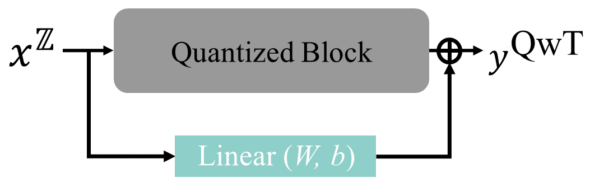

  

## 📌 Changelog

- **2025-07-08**: Release code implementing QwT + OPT, evaluated on WikiText. 
- **2025-07-08**: Implementing QwT + Llama, under evaluated. 
- **2025-07-08**: QwT + OPT/Llama is good, implement per group compress. 
- **2025-07-08**: Per group compress under evaluated. 
- **2025-07-09**: Evaluate per group compress. 
---